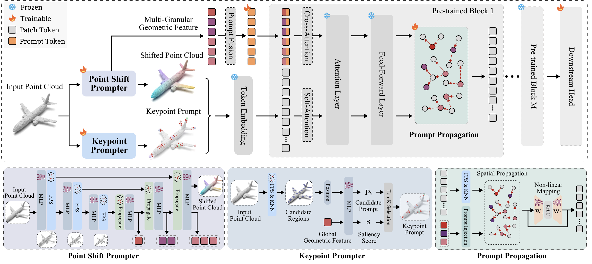
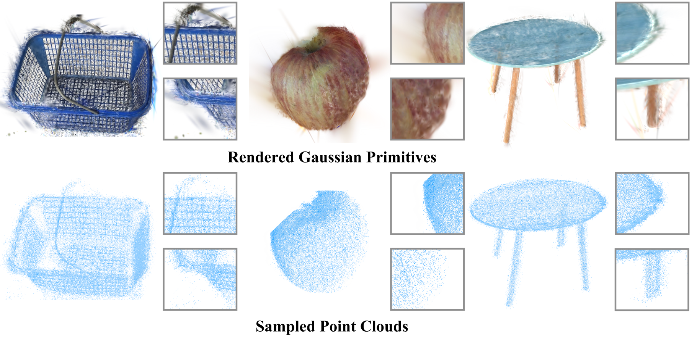
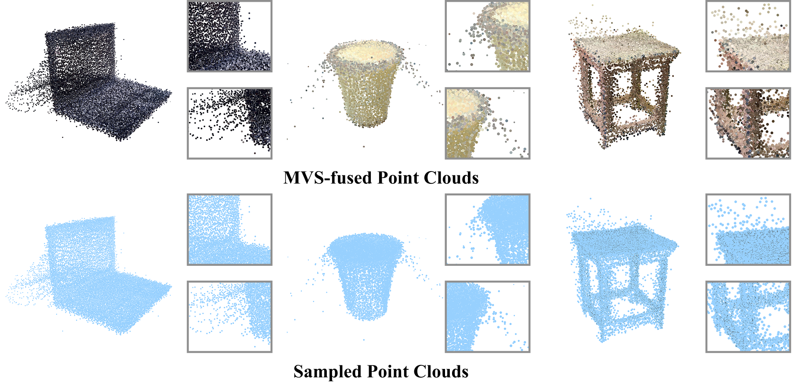

# GAPrompt++: Multi-Granular Geometry-Aware Point Cloud Prompt for 3D Vision Model

<div align="center">
  Zixiang Ai<sup>1,*</sup>&emsp;
  Zhenyu Cui<sup>2,*</sup>&emsp;
  Yufei Guo<sup>3,*</sup>&emsp;
  Wenwen Qiang<sup>4</sup>&emsp;
  Lei Chen<sup>2</sup>&emsp;
  Jiwen Lu<sup>2</sup>&emsp;
  Jiahuan Zhou<sup>1,†</sup>
</div>

<div align="center">
  <sup>1</sup>Wangxuan Institute of Computer Technology, Peking University<br>
  <sup>2</sup>Department of Automation, Tsinghua University<br>
  <sup>3</sup>Intelligent Science and Technology Academy of CASIC<br>
  <sup>4</sup>Institute of Software, Chinese Academy of Sciences
</div>

<p align="center">
  <sup>*</sup>Equal contribution&emsp;
  <sup>†</sup>Corresponding author
</p>

<p align="center">
  <a href="https://github.com/PKU-OV3-LAB/GAPromptPlus"></a>
  <a href="https://ieeexplore.ieee.org/document/11676080"></a>
  <a href="https://github.com/zhoujiahuan1991/ICML2025-GAPrompt"></a>
  <a href="https://huggingface.co/datasets/zxAi/GSModel60"></a>
  <a href="https://huggingface.co/datasets/zxAi/uCO3D80"></a>
</p>

<div align="center">
Official implementation of <strong>GAPrompt++</strong>. The paper has been accepted for publication.
</div>

<p align="center">
  
</p>

GAPrompt++ adapts pre-trained 3D models with multi-granular geometric prompts.
The Point Shift Prompter extracts instance-specific geometry, the Keypoint
Prompter locates salient structures, and Prompt Propagation injects these cues
throughout the frozen backbone. The method is evaluated on object
classification, part segmentation, and scene semantic segmentation.

## Installation

```bash
git clone https://github.com/PKU-OV3-LAB/GAPromptPlus.git
cd GAPromptPlus

conda create -n gapromptplus python=3.11 -y
conda activate gapromptplus
pip install -r requirements.txt
```

CUDA extensions must match the local PyTorch and CUDA installation. The release
was tested with Python 3.11, PyTorch 2.8.0, and CUDA 12.8.

## Data

Standard benchmarks follow their official preparation procedures. The two
reconstruction-derived classification datasets are available on Hugging Face:

- [GSModel60](https://huggingface.co/datasets/zxAi/GSModel60): 13,847 point clouds in 60 classes.
- [uCO3D80](https://huggingface.co/datasets/zxAi/uCO3D80): 20,464 point clouds in 80 classes.

See [docs/DATASETS.md](docs/DATASETS.md) for directory settings and integrity
verification.

<table>
  <tr>
    <td align="center"></td>
    <td align="center"></td>
  </tr>
  <tr>
    <td align="center"><strong>GSModel60</strong></td>
    <td align="center"><strong>uCO3D80</strong></td>
  </tr>
</table>

## Object-level tasks

`object_level/` contains object classification and ShapeNetPart part
segmentation. Paper configs are grouped under:

```text
object_level/cfgs/
├── classification/
├── part_segmentation/
└── dataset_configs/
```

Classification example:

```bash
cd object_level
python main.py \
  --config cfgs/classification/gapromptpp-point-pqae-scanobjectnn-pb-t50-rs.yaml \
  --ckpts /path/to/pretrained_backbone.pth
```

ShapeNetPart example:

```bash
cd object_level
python main.py \
  --config cfgs/part_segmentation/gapromptpp-point-pqae-shapenetpart.yaml \
  --ckpts /path/to/pretrained_backbone.pth
```

## Scene-level tasks

`scene_level/` contains semantic segmentation on S3DIS, ScanNet, and NuScenes.

```bash
cd scene_level
python main.py \
  --cfg_path configs/concerto-gapromptplus/semseg-ptv3-base-v1m1-0a-scannet-lin.py \
  --mode test \
  --weight /path/to/model_best.pth \
  --save_path results/scannet \
  --gpus 1
```

The reported scene results use one GPU, batch size 1, and full-fragment voting.

## Checkpoints

Checkpoint links will be added after the public model license is finalized.
The configuration files required to reproduce the paper tables are already
included in `object_level/cfgs/` and `scene_level/configs/`.

## Citation

```bibtex
@ARTICLE{11676080,
  author={Ai, Zixiang and Cui, Zhenyu and Guo, Yufei and Qiang, Wenwen and Chen, Lei and Lu, Jiwen and Zhou, Jiahuan},
  journal={IEEE Transactions on Pattern Analysis and Machine Intelligence},
  title={GAPrompt++: Multi-Granular Geometry-Aware Point Cloud Prompt for 3D Vision Model},
  year={2026},
  volume={},
  number={},
  pages={1-18},
  keywords={Modeling;Clouds;Tuning;Training;Computers;Visual systems;Geometry;Point Cloud;Prompt Learning;Parameter-efficient Fine-tuning},
  doi={10.1109/TPAMI.2026.3729984}
}
```

## Acknowledgement

This code builds on [GAPrompt](https://github.com/zhoujiahuan1991/ICML2025-GAPrompt),
[Point-BERT](https://github.com/lulutang0608/Point-BERT),
[Point-MAE](https://github.com/Pang-Yatian/Point-MAE),
[ReCon](https://github.com/qizekun/ReCon),
[PointGPT](https://github.com/CGuangyan-BIT/PointGPT),
[Point-FEMAE](https://github.com/zyh16143998882/AAAI24-PointFEMAE),
[Point-PEFT](https://github.com/Ivan-Tang-3D/Point-PEFT),
[PointGST](https://github.com/jerryfeng2003/PointGST),
[Pointcept](https://github.com/Pointcept/Pointcept), and
[Concerto](https://github.com/Pointcept/Concerto).

## License

The scene-level code retains the license in `scene_level/LICENSE`. The
repository-wide license will be added after author approval; see
`LICENSE_STATUS.md`.
